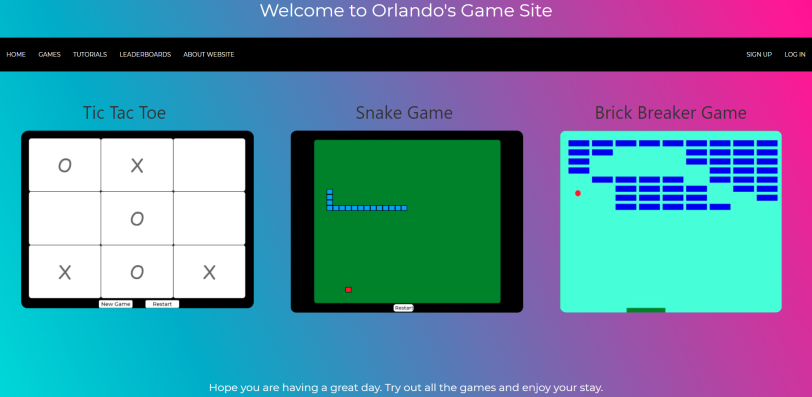

# CS50x Final Project  

## Summary

This is my Final Project for the certificate course CS50x: Intro to Computer Scienece. I worked by myself and took on the task of creating a website application that hosts three games. The three games are: Tic Tac Toe, Snake, and Brick Breaker. I learned a lot doing this project and it really opened my eyes as to the different parts to a web app and how they are all connected.

## Preview

##### Orlando Rodriguez